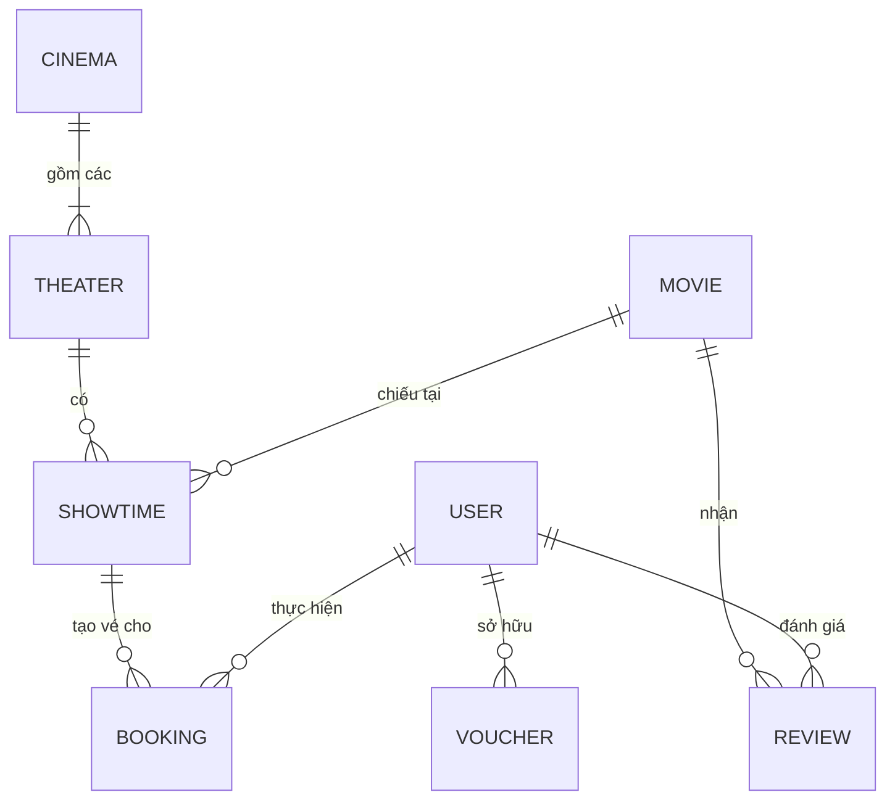

# 🗄️ Thiết Kế Cơ Sở Dữ Liệu (MongoDB Schema) - MERN Cinema

Dưới đây là chi tiết thiết kế các Collection (Bảng) trong cơ sở dữ liệu MongoDB. Hệ thống áp dụng cấu trúc dữ liệu tối ưu cho NoSQL, kết hợp linh hoạt giữa Embedded Documents (Dữ liệu nhúng) và References (Dữ liệu tham chiếu) để đảm bảo tốc độ và hiệu suất cao nhất.

## 1. 📊 Sơ Đồ Thực Thể Liên Kết (ER Diagram)

---

## 2. 📝 Cấu Trúc Các Collection Chi Tiết

### 🧑‍💻 2.1. User Collection (`users`)
Lưu trữ thôngত্তি tài khoản người dùng, nhân viên, quản trị viên.

| Field | Type | Required | Description |
| :--- | :--- | :--- | :--- |
| `_id` | ObjectId | Yes | ID tự động của MongoDB |
| `name` | String | Yes | Tên hiển thị của người dùng |
| `email` | String | Yes | Email đăng nhập (Unique) |
| `password` | String | Yes | Mật khẩu đã được mã hóa (Bcrypt) |
| `phone` | String | No | Số điện thoại |
| `role` | String | Yes | Quyền: `user`, `staff`, `manager`, `admin` (Default: `user`) |
| `points` | Number | Yes | Điểm tích lũy thành viên (Default: 0) |
| `avatar` | String | No | URL ảnh đại diện |
| `createdAt`| Date | Yes | Thời gian tạo tài khoản |

### 🎬 2.2. Movie Collection (`movies`)
Quản lý danh sách các bộ phim đang chiếu rạp và phim trực tuyến (VOD).

| Field | Type | Required | Description |
| :--- | :--- | :--- | :--- |
| `_id` | ObjectId | Yes | ID tự động của MongoDB |
| `title` | String | Yes | Tên bộ phim |
| `description` | String | Yes | Tóm tắt nội dung phim |
| `poster` | String | Yes | URL ảnh bìa tĩnh (Lưu trên Cloudinary/S3) |
| `trailer` | String | Yes | URL video trailer |
| `duration` | Number | Yes | Thời lượng phim (phút) |
| `format` | Array[String]| Yes | Định dạng hỗ trợ (VD: `['2D', '3D', 'IMAX']`) |
| `ageRating` | String | Yes | Nhãn độ tuổi (VD: `P`, `C13`, `C16`, `C18`) |
| `status` | String | Yes | Trạng thái: `Coming`, `Showing`, `VOD` |
| `vodPrice` | Number | No | Giá thuê phim trực tuyến (Nếu status là VOD) |
| `isVOD` | Boolean | Yes | Đánh dấu phim có được xem online hay không (Default: false) |

### 🏢 2.3. Cinema Collection (`cinemas`)
Quản lý thông tin cụm rạp. Sử dụng GeoJSON để tìm rạp gần nhất.

| Field | Type | Required | Description |
| :--- | :--- | :--- | :--- |
| `_id` | ObjectId | Yes | ID tự động |
| `name` | String | Yes | Tên cụm rạp (VD: Lotte Cinema Landmark) |
| `address` | String | Yes | Địa chỉ chi tiết |
| `location` | Object | Yes | Tọa độ GeoJSON `{ type: "Point", coordinates: [lng, lat] }` |
| `hotline` | String | Yes | Số điện thoại liên hệ rạp |

### 💺 2.4. Theater Collection (`theaters`)
Quản lý các phòng chiếu thuộc một rạp. Tích hợp sẵn sơ đồ ghế.

| Field | Type | Required | Description |
| :--- | :--- | :--- | :--- |
| `_id` | ObjectId | Yes | ID phòng chiếu |
| `cinemaId` | ObjectId | Yes | Reference tới `cinemas` |
| `name` | String | Yes | Tên phòng (VD: Phòng 1, IMAX 2) |
| `seatLayout`| Array[Object]| Yes | Sơ đồ ma trận ghế. VD: `[{ row: "A", seats: [{ col: 1, type: "normal", status: "active" }] }]` |

### 📅 2.5. Showtime Collection (`showtimes`)
Quản lý lịch chiếu phim. Khóa ghế bằng cách đẩy ID ghế vào mảng `bookedSeats` để xử lý Real-time.

| Field | Type | Required | Description |
| :--- | :--- | :--- | :--- |
| `_id` | ObjectId | Yes | ID lịch chiếu |
| `movieId` | ObjectId | Yes | Reference tới `movies` |
| `theaterId` | ObjectId | Yes | Reference tới `theaters` |
| `startTime` | Date | Yes | Thời gian bắt đầu chiếu |
| `endTime` | Date | Yes | Thời gian kết thúc dự kiến |
| `basePrice` | Number | Yes | Giá vé cơ bản của suất chiếu (Tùy chỉnh theo giờ vàng/cuối tuần) |
| `bookedSeats`| Array[String]| Yes | Mảng chứa mã các ghế đã bán (VD: `["A1", "A2"]`). Chống race condition. |

### 🎫 2.6. Booking Collection (`bookings` - Đa Hình)
Bảng Đơn Hàng xử lý chung cho cả **Mua Vé Rạp** và **Thuê Phim VOD**.

| Field | Type | Required | Description |
| :--- | :--- | :--- | :--- |
| `_id` | ObjectId | Yes | Mã đơn hàng / ID |
| `userId` | ObjectId | Yes | Reference tới `users` |
| `type` | String | Yes | Loại đơn: `TICKET` (Vé rạp) hoặc `VOD` (Thuê phim) |
| `totalPrice`| Number | Yes | Tổng số tiền cần thanh toán |
| `paymentStatus`| String | Yes | Trạng thái: `Pending`, `Success`, `Failed` |
| `paymentMethod`| String | Yes | Phương thức thanh toán (VD: `VNPay`, `MoMo`) |
| `voucherId` | ObjectId | No | Reference tới bảng `vouchers` (nếu dùng mã) |
| `showtimeId`| ObjectId | No | Reference tới `showtimes` (Bắt buộc nếu type=TICKET) |
| `tickets` | Array[Object]| No | D/s vé: `[{ seatId: "A1", price: 80k, qrCode: "..", guestEmail: ".." }]` |
| `movieId` | ObjectId | No | Reference tới `movies` (Bắt buộc nếu type=VOD) |
| `vodExpireAt`| Date | No | Thời điểm hết hạn xem phim VOD (nếu type=VOD) |
| `createdAt` | Date | Yes | Thời gian tạo đơn hàng |

### 🎁 2.7. Voucher Collection (`vouchers`)
Quản lý mã giảm giá, khuyến mãi và đền bù cho khách hàng.

| Field | Type | Required | Description |
| :--- | :--- | :--- | :--- |
| `_id` | ObjectId | Yes | ID hệ thống |
| `code` | String | Yes | Mã nhập (VD: `DENBU100`, `NEWBIE50`) |
| `discountType`| String | Yes | Loại giảm giá: `percent` (%) hoặc `fixed` (VNĐ) |
| `discountValue`| Number | Yes | Giá trị giảm (VD: 50,000 hoặc 20%) |
| `expiryDate`| Date | Yes | Ngày hết hạn |
| `userId` | ObjectId | No | Nếu Voucher tạo ra để đền bù riêng cho 1 user (CSKH) |
| `isActive` | Boolean | Yes | Trạng thái mã còn hoạt động không |

### ⭐ 2.8. Review Collection (`reviews`)
Quản lý bình luận và đánh giá sao của phim.

| Field | Type | Required | Description |
| :--- | :--- | :--- | :--- |
| `_id` | ObjectId | Yes | ID Review |
| `userId` | ObjectId | Yes | Reference tới `users` |
| `movieId` | ObjectId | Yes | Reference tới `movies` |
| `rating` | Number | Yes | Điểm đánh giá (1-5 sao) |
| `comment` | String | Yes | Nội dung bình luận |
| `createdAt` | Date | Yes | Thời gian bình luận |
