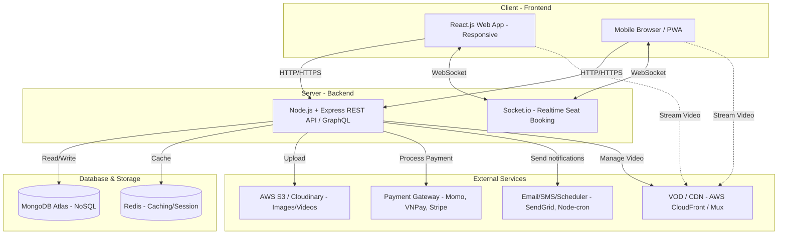
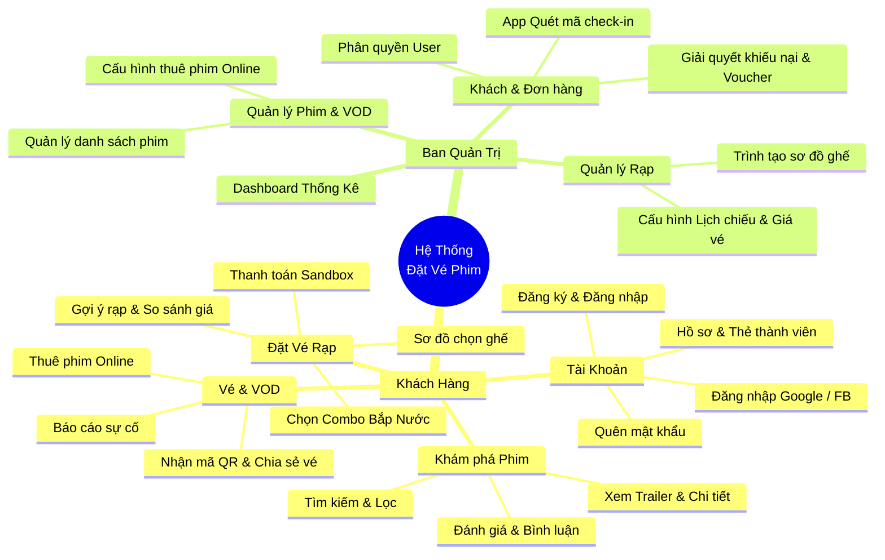
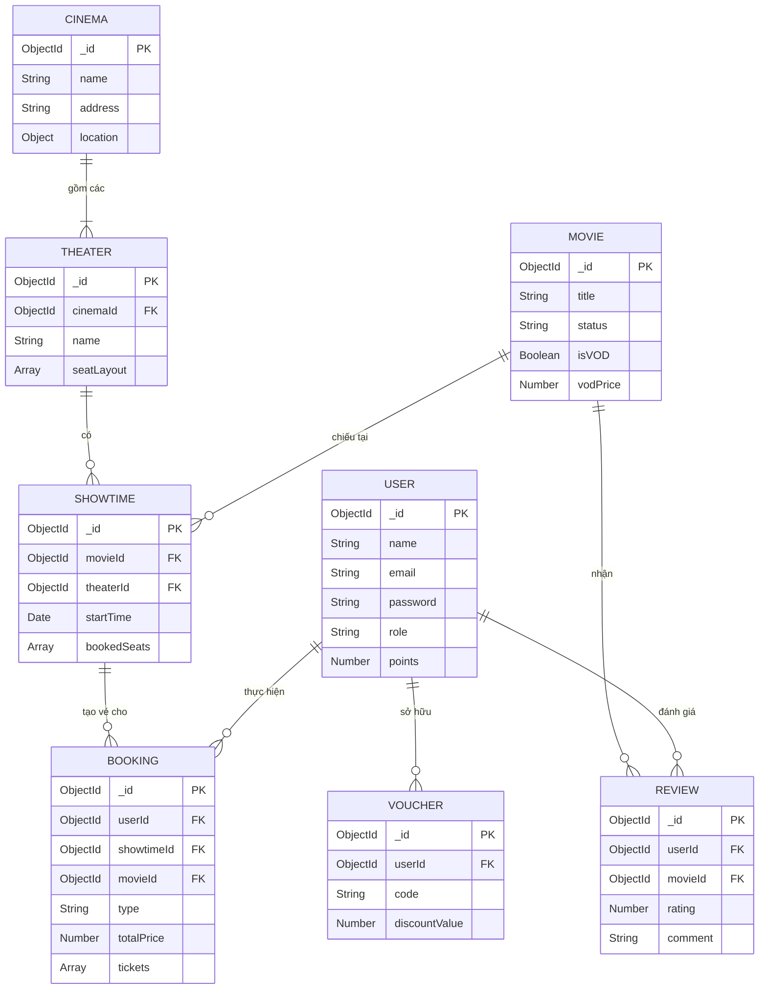

# 🎬 THIẾT KẾ HỆ THỐNG ĐẶT VÉ XEM PHIM (MERN STACK)

Tài liệu này mô tả chi tiết kiến trúc và tính năng cho hệ thống đặt vé xem phim đa nền tảng (Desktop & Smartphone) sử dụng MERN stack.

---

## 1. 🏗️ CẤU TRÚC HẠ TẦNG (INFRASTRUCTURE ARCHITECTURE)

Hệ thống được thiết kế theo mô hình Client-Server hiện đại, tích hợp các dịch vụ Cloud nhằm đảm bảo hiệu năng và khả năng mở rộng.

### Chi tiết các thành phần:

| Thành phần | Công nghệ / Dịch vụ | Vai trò trong hệ thống |
| :--- | :--- | :--- |
| **Frontend** | React.js, Tailwind CSS, Redux | Giao diện người dùng đa nền tảng (Mobile-First). Xử lý State và API calls. |
| **Backend** | Node.js, Express.js | Xử lý logic nghiệp vụ, RESTful API (hỗ trợ **Phân trang/Pagination**, Lọc, Sắp xếp), phân quyền (JWT). |
| **Real-time**| Socket.io | Khóa ghế tức thời (Real-time seat lock) tránh trùng lặp khi 2 người cùng đặt 1 ghế. |
| **Database** | MongoDB Atlas | CSDL NoSQL lưu trữ linh hoạt Phim, Rạp, Lịch chiếu, Vé, User. |
| **Caching**  | Redis | Cache danh sách phim, lịch chiếu giúp giảm tải Database; Rate Limiting. |
| **Storage**  | AWS S3 / Cloudinary | Lưu trữ tĩnh: Poster phim, Avatar người dùng, Trailer. |
| **VOD & CDN (MỚI)**| AWS CloudFront / Mux | Dịch vụ phân phối video (Streaming) tốc độ cao cho tính năng thuê phim Online, hỗ trợ bảo mật (DRM) chống tải lậu. |
| **Payment**  | VNPay, MoMo, Stripe | Xử lý thanh toán, webhook cập nhật trạng thái đơn hàng. |
| **Scheduler**| Node-cron / BullMQ | Chạy background job gửi Email nhắc nhở xem phim, gửi Voucher tự động. |

---

## 2. 🗺️ SƠ ĐỒ PHÂN RÃ CHỨC NĂNG (WBS - Work Breakdown Structure)

Sơ đồ dưới đây thể hiện sự phân nhánh của toàn bộ các chức năng từ cấp cao nhất đến các chức năng con chi tiết (như Quên mật khẩu, Đăng ký...).

---

## 3. 📋 DANH SÁCH CHỨC NĂNG CHI TIẾT

### 🧑‍💻 A. Khách Hàng (User)

| Nhóm Tính Năng | Chi tiết |
| :--- | :--- |
| **1. Khám phá & Tìm kiếm** | - **Trang chủ:** Banner phim, Phim đang/sắp chiếu (**Phân trang/Infinite Scroll** tối ưu tải). - **Tìm kiếm & Lọc:** Tìm theo tên, thể loại, đạo diễn, rạp, định dạng (2D/3D). - **Chi tiết phim:** Trailer, Tóm tắt, Diễn viên. - **Tương tác:** Đọc bình luận (hỗ trợ Nút Tải thêm/Pagination), Rate sao, Thích và phản hồi. |
| **2. Đặt vé rạp (Cốt lõi)** | - **Lựa chọn:** Chọn phim -> Chọn rạp -> Chọn lịch chiếu. - **Gợi ý rạp:** Dùng Geolocation (GPS) ưu tiên rạp gần nhất. - **So sánh giá:** Xem bảng so sánh giá vé cùng phim giữa các rạp. - **Sơ đồ ghế:** Giao diện trực quan (Trống, Đang chọn, Đã bán, VIP, Sweetbox). - **Combo:** Chọn bắp nước, áp dụng mã giảm giá (Voucher). - **Thanh toán:** Tích hợp ví điện tử, ngân hàng, điểm thưởng. |
| **3. Thuê phim Online (VOD - MỚI)** | - **Thư viện:** Danh sách phim đã ngừng chiếu rạp được chuyển sang dạng Digital. - **Thuê phim (Rental):** Thanh toán để mở khóa phim (ví dụ: xem không giới hạn trong 48 giờ). - **Video Player:** Trình phát video chất lượng cao (1080p/4K), hỗ trợ đa ngôn ngữ/phụ đề và bảo mật chống tải lậu (DRM). |
| **4. Nhận vé & Đi cùng** | - **Nhận vé:** Hiển thị mã QR vé điện tử, gửi qua Email. - **Chia sẻ vé:** Nhập Email/SĐT người đi cùng để hệ thống phân phối mã QR cho từng người. - **Nhắc nhở:** Tự động gửi Email nhắc nhở (2-4 tiếng trước giờ) cho toàn bộ nhóm. |
| **5. Tài khoản (Profile)** | - **Xác thực:** Đăng ký/Đăng nhập (Email, Google, Facebook OAuth2). - **Hồ sơ:** Cập nhật Avatar, mật khẩu, lịch sử đặt vé, tủ phim đã thuê. - **Thành viên:** Tích điểm, nâng hạng (Bạc, Vàng, Kim Cương). - **Báo cáo sự cố:** Gửi khiếu nại (kèm mã vé/mã đơn thuê) nếu gặp lỗi kỹ thuật. |

### 👑 B. Ban Quản Trị (Admin / Owner)

| Nhóm Tính Năng | Chi tiết |
| :--- | :--- |
| **1. Tổng quan (Dashboard)** | - Biểu đồ thống kê doanh thu (Ngày/Tuần/Tháng/Năm). - Báo cáo tỷ lệ lấp đầy phòng chiếu, phim ăn khách, rạp đông khách. |
| **2. Quản lý Phim & VOD** | - Thêm/Sửa/Xóa phim, Upload Poster/Trailer. - Quản lý nhãn dán độ tuổi (C13, C16, C18), thể loại phim. - **Phân phối Online (MỚI):** Chuyển trạng thái phim từ "Chiếu rạp" sang "Cho thuê Online", upload file video gốc, cấu hình giá thuê và thời hạn xem. |
| **3. Quản lý Rạp & Phòng** | - Quản lý thông tin chuỗi rạp (Địa chỉ, Hotline, Hình ảnh). - **Seat Map Builder:** Công cụ ma trận tạo sơ đồ ghế trực quan cho từng phòng chiếu. |
| **4. Quản lý Lịch chiếu** | - Lên lịch chiếu (Phim -> Rạp -> Phòng -> Thời gian). - Cảnh báo trùng lịch, cấu hình giá vé linh hoạt (Giờ vàng, Cuối tuần). |
| **5. Quản lý Đơn & Khách** | - Xem danh sách giao dịch (Tất cả Data Tables đều có **Phân trang, Tìm kiếm, Lọc**). - **App Quét vé:** Nhân viên dùng thiết bị quét mã QR check-in khách tại rạp. - Quản lý User, phân quyền (Staff, Manager, SuperAdmin), điểm thưởng. |
| **6. Khuyến mãi & CSKH** | - **Voucher:** Tạo và quản lý mã giảm giá, Combo bắp nước. - **Giải quyết khiếu nại (MỚI):** Nhận báo cáo sự cố từ khách. Nút **Bồi thường** tự động gửi Voucher xin lỗi vào tài khoản/email khách. |

---

## 4. 💡 GIẢI PHÁP CHO DỰ ÁN DEMO (KHÔNG KINH PHÍ)

Vì đây là dự án Demo, bạn hoàn toàn có thể triển khai thực tế **100% không tốn phí** bằng cách sử dụng các gói Free Tier của các dịch vụ:
- **Database:** MongoDB Atlas cung cấp gói Shared Cluster miễn phí 512MB (Đủ lưu trữ hàng chục ngàn dữ liệu test).
- **Lưu trữ Ảnh/VOD:** Sử dụng Cloudinary (Miễn phí 25GB băng thông/tháng). Với phim VOD, bạn có thể cắt trailer ngắn vài phút để demo hoặc nhúng video dạng Unlisted từ Youtube/Google Drive.
- **Hosting:** Deploy Frontend lên Vercel/Netlify (Hoàn toàn miễn phí). Deploy Backend lên Render.com (Gói free).
- **Gửi Email/Nhắc nhở:** Sử dụng thư viện `nodemailer` kết nối thẳng với tài khoản Gmail cá nhân để gửi mail miễn phí.
- **Thanh toán:** VNPay, MoMo hay Stripe đều cung cấp môi trường **Sandbox (Test)**. Bạn có thể demo thanh toán y như thật bằng các tài khoản ngân hàng "ảo" do họ cấp.

---

## 5. 🚀 CÁC BƯỚC TRIỂN KHAI (ROADMAP)

> [!TIP]
> **Chiến lược UI/UX:**
> Hệ thống cần áp dụng chiến lược **Mobile-First** bằng Tailwind CSS vì đa số người dùng đặt vé qua điện thoại. Tính năng quan trọng nhất cần trau chuốt là **Sơ đồ chọn ghế (Seat Map)** trên màn hình cảm ứng nhỏ.

1. **Thiết kế Database Schema (CSDL):** Lên cấu trúc các Collection MongoDB (Users, Movies, Cinemas, Theaters, Showtimes, Tickets, Reviews).
2. **Khởi tạo Project:** Setup Git repo, tạo folder `frontend` (Vite + React) và `backend` (Express).
3. **Phát triển Backend & API:** Xây dựng luồng xác thực, CRUD phim/rạp, luồng đặt vé và tích hợp Payment Gateway.
4. **Phát triển Frontend:** Ghép giao diện, kết nối API, làm chức năng chọn ghế Real-time (Socket.io).
5. **Testing & Deployment:** Triển khai lên Vercel (Frontend) và Render/AWS (Backend), MongoDB Atlas.

---

## 6. 📊 THIẾT KẾ CƠ SỞ DỮ LIỆU (DATABASE SCHEMA)

Dưới đây là chi tiết thiết kế các Collection (Bảng) trong cơ sở dữ liệu MongoDB. Hệ thống áp dụng cấu trúc dữ liệu tối ưu cho NoSQL, kết hợp linh hoạt giữa Embedded Documents (Dữ liệu nhúng) và References (Dữ liệu tham chiếu) để đảm bảo tốc độ và hiệu suất cao nhất.

## 1. 📊 Sơ Đồ Thực Thể Liên Kết (ER Diagram)

---

## 2. 📝 Cấu Trúc Các Collection Chi Tiết

### 🧑‍💻 2.1. User Collection (`users`)
Lưu trữ thôngত্তি tài khoản người dùng, nhân viên, quản trị viên.

| Field | Type | Required | Description |
| :--- | :--- | :--- | :--- |
| `_id` | ObjectId | Yes | ID tự động của MongoDB |
| `name` | String | Yes | Tên hiển thị của người dùng |
| `email` | String | Yes | Email đăng nhập (Unique) |
| `password` | String | Yes | Mật khẩu đã được mã hóa (Bcrypt) |
| `phone` | String | No | Số điện thoại |
| `role` | String | Yes | Quyền: `user`, `staff`, `manager`, `admin` (Default: `user`) |
| `points` | Number | Yes | Điểm tích lũy thành viên (Default: 0) |
| `avatar` | String | No | URL ảnh đại diện |
| `createdAt`| Date | Yes | Thời gian tạo tài khoản |

### 🎬 2.2. Movie Collection (`movies`)
Quản lý danh sách các bộ phim đang chiếu rạp và phim trực tuyến (VOD).

| Field | Type | Required | Description |
| :--- | :--- | :--- | :--- |
| `_id` | ObjectId | Yes | ID tự động của MongoDB |
| `title` | String | Yes | Tên bộ phim |
| `description` | String | Yes | Tóm tắt nội dung phim |
| `poster` | String | Yes | URL ảnh bìa tĩnh (Lưu trên Cloudinary/S3) |
| `trailer` | String | Yes | URL video trailer |
| `duration` | Number | Yes | Thời lượng phim (phút) |
| `format` | Array[String]| Yes | Định dạng hỗ trợ (VD: `['2D', '3D', 'IMAX']`) |
| `ageRating` | String | Yes | Nhãn độ tuổi (VD: `P`, `C13`, `C16`, `C18`) |
| `status` | String | Yes | Trạng thái: `Coming`, `Showing`, `VOD` |
| `vodPrice` | Number | No | Giá thuê phim trực tuyến (Nếu status là VOD) |
| `isVOD` | Boolean | Yes | Đánh dấu phim có được xem online hay không (Default: false) |

### 🏢 2.3. Cinema Collection (`cinemas`)
Quản lý thông tin cụm rạp. Sử dụng GeoJSON để tìm rạp gần nhất.

| Field | Type | Required | Description |
| :--- | :--- | :--- | :--- |
| `_id` | ObjectId | Yes | ID tự động |
| `name` | String | Yes | Tên cụm rạp (VD: Lotte Cinema Landmark) |
| `address` | String | Yes | Địa chỉ chi tiết |
| `location` | Object | Yes | Tọa độ GeoJSON `{ type: "Point", coordinates: [lng, lat] }` |
| `hotline` | String | Yes | Số điện thoại liên hệ rạp |

### 💺 2.4. Theater Collection (`theaters`)
Quản lý các phòng chiếu thuộc một rạp. Tích hợp sẵn sơ đồ ghế.

| Field | Type | Required | Description |
| :--- | :--- | :--- | :--- |
| `_id` | ObjectId | Yes | ID phòng chiếu |
| `cinemaId` | ObjectId | Yes | Reference tới `cinemas` |
| `name` | String | Yes | Tên phòng (VD: Phòng 1, IMAX 2) |
| `seatLayout`| Array[Object]| Yes | Sơ đồ ma trận ghế. VD: `[{ row: "A", seats: [{ col: 1, type: "normal", status: "active" }] }]` |

### 📅 2.5. Showtime Collection (`showtimes`)
Quản lý lịch chiếu phim. Khóa ghế bằng cách đẩy ID ghế vào mảng `bookedSeats` để xử lý Real-time.

| Field | Type | Required | Description |
| :--- | :--- | :--- | :--- |
| `_id` | ObjectId | Yes | ID lịch chiếu |
| `movieId` | ObjectId | Yes | Reference tới `movies` |
| `theaterId` | ObjectId | Yes | Reference tới `theaters` |
| `startTime` | Date | Yes | Thời gian bắt đầu chiếu |
| `endTime` | Date | Yes | Thời gian kết thúc dự kiến |
| `basePrice` | Number | Yes | Giá vé cơ bản của suất chiếu (Tùy chỉnh theo giờ vàng/cuối tuần) |
| `bookedSeats`| Array[String]| Yes | Mảng chứa mã các ghế đã bán (VD: `["A1", "A2"]`). Chống race condition. |

### 🎫 2.6. Booking Collection (`bookings` - Đa Hình)
Bảng Đơn Hàng xử lý chung cho cả **Mua Vé Rạp** và **Thuê Phim VOD**.

| Field | Type | Required | Description |
| :--- | :--- | :--- | :--- |
| `_id` | ObjectId | Yes | Mã đơn hàng / ID |
| `userId` | ObjectId | Yes | Reference tới `users` |
| `type` | String | Yes | Loại đơn: `TICKET` (Vé rạp) hoặc `VOD` (Thuê phim) |
| `totalPrice`| Number | Yes | Tổng số tiền cần thanh toán |
| `paymentStatus`| String | Yes | Trạng thái: `Pending`, `Success`, `Failed` |
| `paymentMethod`| String | Yes | Phương thức thanh toán (VD: `VNPay`, `MoMo`) |
| `voucherId` | ObjectId | No | Reference tới bảng `vouchers` (nếu dùng mã) |
| `showtimeId`| ObjectId | No | Reference tới `showtimes` (Bắt buộc nếu type=TICKET) |
| `tickets` | Array[Object]| No | D/s vé: `[{ seatId: "A1", price: 80k, qrCode: "..", guestEmail: ".." }]` |
| `movieId` | ObjectId | No | Reference tới `movies` (Bắt buộc nếu type=VOD) |
| `vodExpireAt`| Date | No | Thời điểm hết hạn xem phim VOD (nếu type=VOD) |
| `createdAt` | Date | Yes | Thời gian tạo đơn hàng |

### 🎁 2.7. Voucher Collection (`vouchers`)
Quản lý mã giảm giá, khuyến mãi và đền bù cho khách hàng.

| Field | Type | Required | Description |
| :--- | :--- | :--- | :--- |
| `_id` | ObjectId | Yes | ID hệ thống |
| `code` | String | Yes | Mã nhập (VD: `DENBU100`, `NEWBIE50`) |
| `discountType`| String | Yes | Loại giảm giá: `percent` (%) hoặc `fixed` (VNĐ) |
| `discountValue`| Number | Yes | Giá trị giảm (VD: 50,000 hoặc 20%) |
| `expiryDate`| Date | Yes | Ngày hết hạn |
| `userId` | ObjectId | No | Nếu Voucher tạo ra để đền bù riêng cho 1 user (CSKH) |
| `isActive` | Boolean | Yes | Trạng thái mã còn hoạt động không |

### ⭐ 2.8. Review Collection (`reviews`)
Quản lý bình luận và đánh giá sao của phim.

| Field | Type | Required | Description |
| :--- | :--- | :--- | :--- |
| `_id` | ObjectId | Yes | ID Review |
| `userId` | ObjectId | Yes | Reference tới `users` |
| `movieId` | ObjectId | Yes | Reference tới `movies` |
| `rating` | Number | Yes | Điểm đánh giá (1-5 sao) |
| `comment` | String | Yes | Nội dung bình luận |
| `createdAt` | Date | Yes | Thời gian bình luận |
